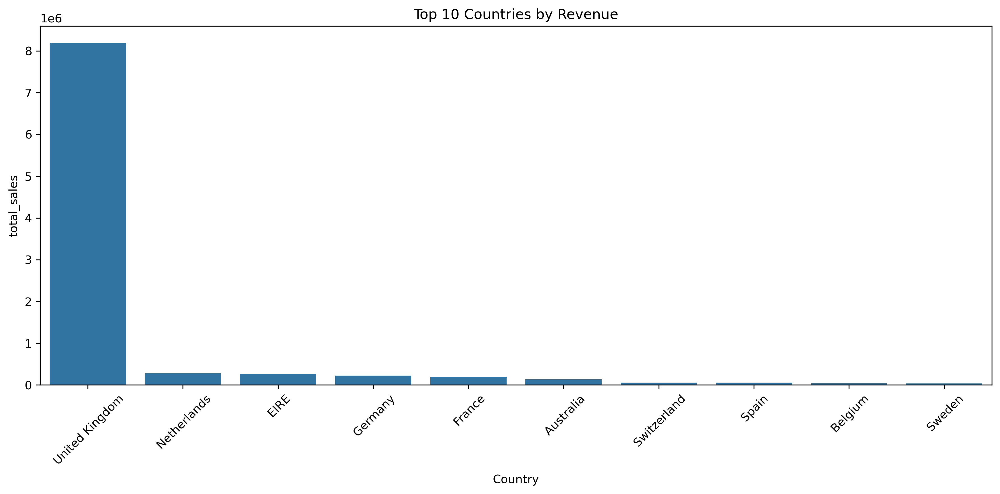

# Online Retail Sales Analysis

## Project Overview
This project analyzes an online retail dataset using:

- Python
- DuckDB
- SQL
- Pandas
- Matplotlib
- Seaborn

The goal was to explore:
- Monthly revenue trends
- Top-selling products
- Country-wise sales
- Customer purchasing behavior

---

## Dataset
Online Retail Dataset containing transaction-level sales data.

Columns include:
- InvoiceNo
- StockCode
- Description
- Quantity
- InvoiceDate
- UnitPrice
- CustomerID
- Country

---

## Technologies Used
- Python
- DuckDB
- SQL
- Pandas
- Matplotlib
- Seaborn
- VS Code

---

## Analysis Performed

### 1. Data Quality Check
- Verified dataset structure
- Checked total rows and columns

### 2. Data Cleaning
- Removed invalid/missing values
- Standardized data types

### 3. Country Sales Analysis
- Calculated revenue by country
- Identified top-performing regions

### 4. Monthly Revenue Trends
- Aggregated monthly sales revenue
- Observed seasonal growth patterns

### 5. Product Analysis
- Identified top-selling products
- Measured quantity sold and revenue

### 6. Customer Analysis
- Found highest-value customers
- Measured repeat purchasing behavior

---

## Visualization

### Top 10 Countries by Revenue


---

## Key Insights
- United Kingdom generated the highest revenue.
- Several products contributed disproportionately to total sales.
- Revenue peaked strongly during late 2011.
- A small number of customers drove large portions of revenue.

---

## Project Structure

```text
01_data_check.py
02_data_cleaning.py
03_country_sales.py
04_monthly_sales.py
05_top_products.py
06_customer_analysis.py
07_country_chart.py
online_retail.csv
country_sales.png
README.md